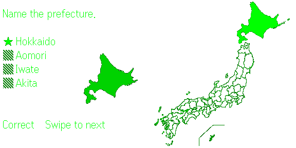

# Japan Map Quiz

A silhouette quiz for Even Realities G2 smart glasses — all 47 Japanese prefectures, played entirely with the R1 ring.

## How a round goes

- A prefecture silhouette floats in your view, with four name choices beside it
- Swipe the ring to choose, tap to lock in your answer
- Once you answer, a full map of Japan appears showing where that prefecture actually sits
- Wrong answers are remembered — "Missed last time" shows when that prefecture comes back around
- Progress is saved after every answer, so you can quit anytime and Continue later

One run covers all 47 prefectures, with a score at the end.

| Title | Finish |
| --- | --- |
|  |  |

## Controls

| Ring input | Action |
| --- | --- |
| Swipe | Move the cursor / next question (after answering) |
| Tap | Select / answer |
| Double-tap | Back to the title (exit from the title screen) |

## Availability

Submitted to Even Hub — this page will be updated once the app is live.

Developed and tested on Android. iOS should work (same ring-input pattern as my other G2 apps) — please report anything odd.

## Roadmap

- Capital-city mode: same silhouettes, answered with the prefectural capital instead (planned for a near-future update)

## Community

Questions, feedback, or just your score — the app's thread on the Even Realities Discord: [Japan Map Quiz](https://discord.com/channels/1301124787740868620/1522969012064096428)

## About this repository

This repo hosts the built web bundle of the app (G2 apps are HTML/JS served inside the Even App).

## Author

**TakeMotions** — X: [@r_tkbyc](https://x.com/r_tkbyc)
